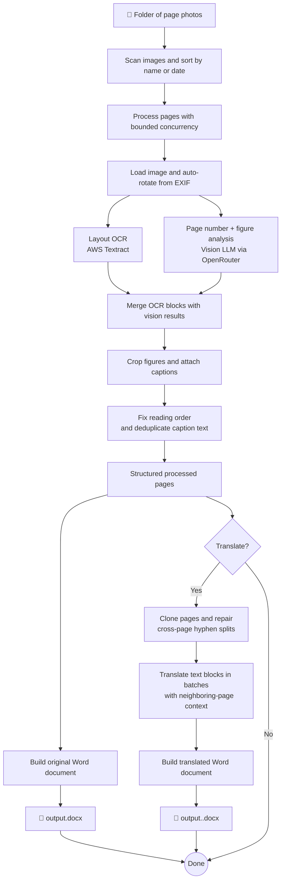

# Book to Digital

Convert photos of physical books into clean, structured digital Word documents — preserving layout, images, and meaning.

This repository is designed to help researchers turn physical books into digital documents, and optionally translated versions, so the material is easier to use in their research workflows.

<p align="center">
  
</p>

## Demo

[Watch the demo video](assets/book-to-digital-demo.mp4)

## How it works

1. Scan the input folder for page images and sort them by filename or file date.
2. Process pages with bounded concurrency. Each image is loaded and auto-rotated from EXIF metadata before analysis.
3. For each page, run **AWS Textract** and the **Vision LLM** in parallel.
   - **Textract** extracts layout-aware text blocks such as titles, section headers, text, lists, and tables.
   - **Vision LLM** detects printed page numbers plus figures, figure bounding boxes, and captions.
4. Merge the OCR and vision results into a single page structure.
   - Textract figure anchors are replaced with cropped figure images from the source page.
   - Vision captions are attached to their figures.
   - A second vision pass reorders blocks for correct reading order on complex or multi-column pages and removes caption duplicates.
5. Build the primary Word document from the processed pages, including page markers, text, tables, figures, captions, and inline error placeholders for any failed pages.
6. If translation is enabled, clone the processed pages, repair cross-page hyphen splits, translate translatable blocks in batches with neighboring-page context, and write a second `.docx` alongside the original.

If `--verbose` is enabled, the pipeline also writes per-page debug JSON files under `debug/original` and `debug/translated`.

## Pipeline



## Prerequisites

- Node.js 24+
- AWS credentials configured (`~/.aws/credentials`, env vars, or IAM role)
- AWS Textract access in your chosen region
- [OpenRouter](https://openrouter.ai/) API key for vision-based page analysis and translation

## Setup

```bash
npm install
cp .env.example .env  # Then fill in your API keys
```

## Usage

```bash
npx tsx src/cli.ts <input-folder> [options]
```

### Options

| Option                       | Description                                  | Default                         |
|------------------------------|----------------------------------------------|---------------------------------|
| `-o, --output <path>`        | Output .docx file path                       | `./output.docx`                 |
| `-c, --concurrency <n>`      | Max pages processed in parallel              | `5`                             |
| `-r, --region <region>`      | AWS region                                   | `AWS_REGION` env or `us-east-1` |
| `-s, --sort <order>`         | Sort order: `name` or `date`                 | `name`                          |
| `-n, --max-pages <n>`        | Max number of pages to process (for testing) |                                 |
| `-t, --translate <language>` | Translate to target language (e.g., `en`)    |                                 |
| `-v, --verbose`              | Enable verbose logging                       | `false`                         |

### Example

```bash
# Process all pages, sorted by filename
npx tsx src/cli.ts ./book-photos -o output/my-book.docx -r eu-central-1 -v

# Process first 5 pages only, sorted by file date
npx tsx src/cli.ts ./book-photos -n 5 -s date -o output/test.docx -r eu-central-1

# Process and translate to English (produces my-book.docx + my-book.en.docx)
npx tsx src/cli.ts ./book-photos -o output/my-book.docx -r eu-central-1 --translate en
```

## Development

```bash
npm test          # Run tests
npm run test:watch # Watch mode
npm run lint      # Type check
npm run build     # Compile to dist/
```
