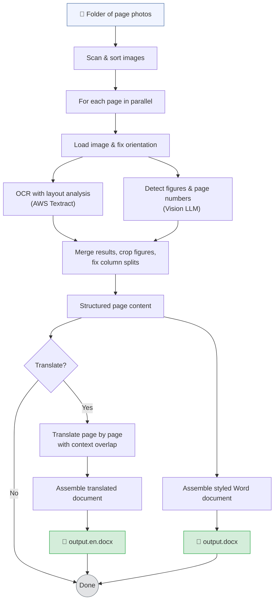

# book-to-digital

Convert photos of physical books into clean, structured digital Word documents — preserving layout, images, and meaning.

## How it works

1. Point the tool at a folder of page photos (JPG/PNG)
2. Each page is processed in parallel:
    - **AWS Textract** extracts text with layout analysis (headings, paragraphs, lists, tables)
    - **Vision LLM** (Gemini 3.1 Pro via OpenRouter) detects figures, bounding boxes, captions, and printed page numbers
3. Figures are cropped from the page images using LLM-detected bounding boxes
4. Everything is assembled into a formatted **.docx** file with text, headings, images, and captions
5. Optionally, a **translated** version of the document is generated using an LLM (one page at a time, with context
   overlap for continuity)

## Pipeline



## Prerequisites

- Node.js 24+
- AWS credentials configured (`~/.aws/credentials`, env vars, or IAM role)
- AWS Textract access in your chosen region
- (Optional) [OpenRouter](https://openrouter.ai/) API key for vision-based figure detection and translation

## Setup

```bash
npm install
cp .env.example .env  # Then fill in your API keys
```

## Usage

```bash
npx tsx src/cli.ts <input-folder> [options]
```

### Options

| Option                       | Description                                  | Default                         |
|------------------------------|----------------------------------------------|---------------------------------|
| `-o, --output <path>`        | Output .docx file path                       | `./output.docx`                 |
| `-c, --concurrency <n>`      | Max concurrent Textract calls                | `5`                             |
| `-r, --region <region>`      | AWS region                                   | `AWS_REGION` env or `us-east-1` |
| `-s, --sort <order>`         | Sort order: `name` or `date`                 | `name`                          |
| `-n, --max-pages <n>`        | Max number of pages to process (for testing) |                                 |
| `-t, --translate <language>` | Translate to target language (e.g., `en`)    |                                 |
| `-v, --verbose`              | Enable verbose logging                       | `false`                         |

### Example

```bash
# Process all pages, sorted by filename
npx tsx src/cli.ts ./book-photos -o output/my-book.docx -r eu-central-1 -v

# Process first 5 pages only, sorted by file date
npx tsx src/cli.ts ./book-photos -n 5 -s date -o output/test.docx -r eu-central-1

# Process and translate to English (produces my-book.docx + my-book.en.docx)
npx tsx src/cli.ts ./book-photos -o output/my-book.docx -r eu-central-1 --translate en
```

## Development

```bash
npm test          # Run tests
npm run test:watch # Watch mode
npm run lint      # Type check
npm run build     # Compile to dist/
```
